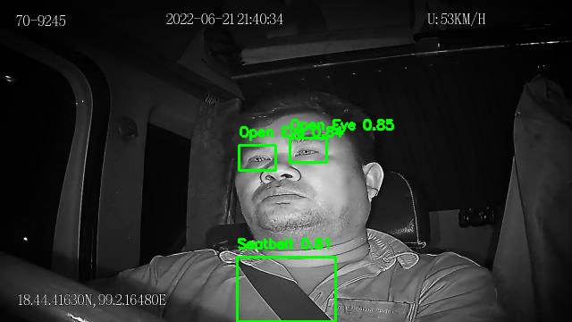
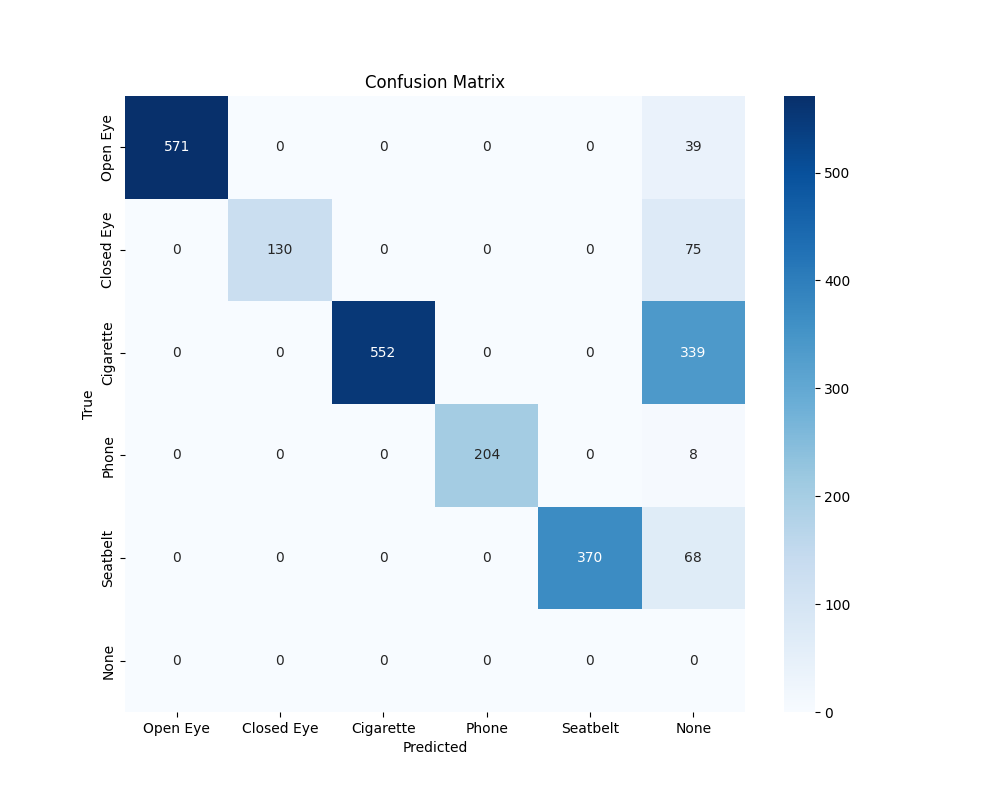
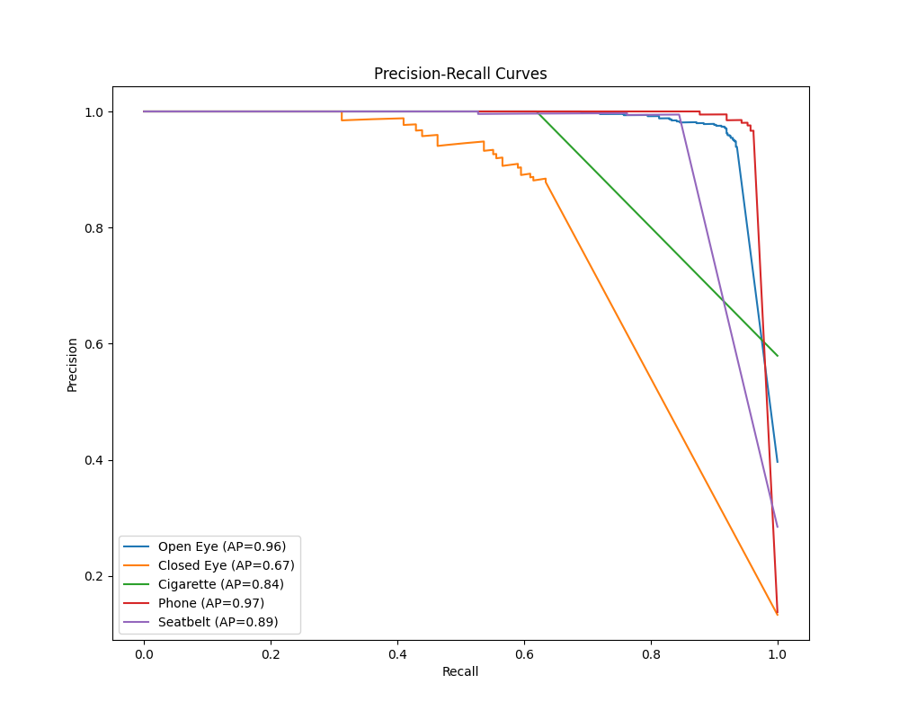

# 🚗 VahakAI – Driver Monitoring System

A real-time Driver Monitoring System (DMS) built using YOLOv8, capable of detecting **Open Eyes**, **Closed Eyes**, **Mobile Phone**, **Seatbelt**, and **Cigarette** usage. The system uses deep learning to predict driver states and displays results through a user-friendly GUI with **confidence scores**, along with options for **recording** and **snapshot saving**.

---

## 📌 Key Features

- 🔍 **Real-time Detection** of 5 critical driver behaviors.
- 🧠 Powered by **YOLOv8** for accurate and fast predictions.
- 🖥️ **Simple GUI** to visualize predictions live with bounding boxes and class scores.
- 💾 **Snapshot & Recording** options to store crucial events.
- 📈 Includes evaluation metrics like **confusion matrix** and **precision-recall curves**.
- ✅ Easily extensible for other driver-related classes or tasks.

---

## 🧠 Predicted Classes

- 👁️ Open Eyes  
- 😴 Closed Eyes  
- 📱 Using Mobile Phone  
- 🪖 Wearing Seatbelt  
- 🚬 Smoking Cigarette  

---

## 🖼️ Sample Output

### 🔍 Detection Screenshots

<p float="left">
  
  
  
</p>

### 📊 Evaluation Results

<p float="left">
  
  
  
</p>

---

## 🚀 Getting Started

Follow these steps to set up and run the project:

### 1. Clone the repository

```bash
git clone https://github.com/yourusername/VahakAI.git
cd VahakAI
